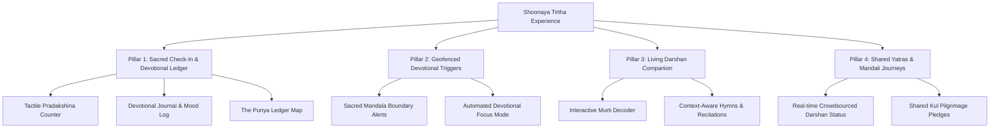

# 🛕 Shoonaya: Sacred Tirtha Platform Strategy & Roadmap
*Author: Prince, Senior Spiritual Product Manager*

Pilgrimage (*Tirtha-Yatra*) is not just travel; it is an outer journey meant to catalyze an inner transformation. In the digital age, a temple map should not feel like Yelp or Google Maps. It should be a **Sacred Gateway**—a tool that facilitates presence, deepens devotion (*Bhakti*), records spiritual footprints, and unites the community (*Mandali*).

This document outlines an extensive, high-IQ product strategy and feature roadmap to transform the Shoonaya **Tirtha Map** into the world’s most engaging, immersive digital pilgrimage companion.

---

## 🧭 The Core Philosophy: "From Navigation to Devotion"
Traditional navigation apps answer: *"Where is the closest temple, and is it open?"*
The **Shoonaya Tirtha Companion** must answer: *"How can I prepare my mind to enter this sacred space, what rituals can I participate in, and how can I carry its spiritual energy back into my daily life?"*

We divide our strategy into four transformative product pillars:



---

## 💎 Pillar 1: The Sacred Check-In & Devotional Ledger
A standard "check-in" feels transactional. A **Sacred Check-In** should feel like a moment of active, conscious dedication. 

### 1. The Tactile Pradakshina (Circumambulation) Counter
*   **The Feature:** When a user checks in at a temple, they are presented with a gorgeous, circular golden button. Each time they complete a physical round (*Pradakshina*) around the sanctum, they tap the button.
*   **The Experience:** The screen animates with a slow, rippling golden wave and subtle, deep tactile haptics. The app logs whether they completed **1, 3, 7, or 108 rounds**, accumulating this directly into their personal Sadhana profile.
*   **Product Value:** Brings physical movement and tactile mindfulness together. It acts as an active meditation helper during their actual temple visit.

### 2. Darshan Journaling & Mood Logging
*   **The Feature:** Instead of leaving a public review, the check-in screen prompts the user to log their inner spiritual state.
*   **The UI/UX:**
    *   *“What was the nature of your Darshan?”* (Options: *Shanti/Peace*, *Ananda/Ecstasy*, *Vairagya/Detachment*, *Bhakti/Devotion*, or *Krupa/Grace*).
    *   A private note field to record thoughts, prayers, or realizations.
    *   Ability to capture a photo of the temple spire (*Shikhara*) or gate (*Gopuram*) for their personal private journal.
*   **Product Value:** Promotes self-reflection and emotional tracking, making Shoonaya a true digital companion for the soul.

### 3. The Punya Ledger (Spiritual Footprints)
*   **The Feature:** A beautifully rendered, interactive, hand-drawn map of ancient India or their local region inside the Sadhana Pulse. 
*   **The Experience:** Every time they visit a historical Tirtha or local temple, that sacred geography gently lights up on their map in a warm saffron glow.
*   **Product Value:** Taps into the historic human drive of " Yatras" (pilgrimage collections) without cheapening it into standard gamification. It visualizes a lifelong spiritual map.

---

## 🔔 Pillar 2: Geofenced Devotional Triggers ("Entering the Mandala")
Using the phone's native GPS and background geofencing (via Capacitor background services), we can make the transition from the material world to the sacred space feel magical.

### 1. Sacred Boundary Notifications
*   **The Feature:** When a pilgrim crosses within **100 meters** of an active temple boundary, their phone receives a soft, low-frequency sound notification (like a quiet single stroke of a temple bell).
*   **The Notification Text:** 
    > *"You are entering the sacred field of [Temple Name]. May your mind find peace. Tap to prepare for Darshan."*
*   **Product Value:** Acts as a gentle call to mindfulness. It breaks their everyday digital noise and alerts them to the proximity of a sacred space.

### 2. Auto-Silent & Focus Mode Prompt
*   **The Feature:** Upon entering the temple's geofenced boundary, the app prompts the user to temporarily silences their notifications or triggers **"Devotional Focus Mode"** inside Shoonaya.
*   **The UI:** The dashboard turns into a dark, minimalist interface showing only a Sanskrit chant and a button to mute device notifications, minimizing distractions.

---

## 📖 Pillar 3: The Living Darshan Companion (Contextual Assistance)
Many young seekers or newcomers feel lost when visiting a temple. They do not know which deity is inside, what the symbols mean, or what hymns to chant.

### 1. Context-Aware Scripture & Stotras
*   **The Feature:** Shoonaya detects the primary deity of the checked-in temple (e.g., Shiva, Durga, Guru Nanak, or a Tirthankara) and dynamically loads the matching sacred text directly on the screen.
*   **Example:**
    *   At a Shiva Temple: Loads the *Shiva Tandava Stotram* or *Bilvashtakam* in the high-fidelity immersive reader (which can fallback to browser speech synthesis if they want to listen to correct pronunciation).
    *   At a Gurudwara: Loads the *Japji Sahib* in Gurmukhi with translations.
*   **Product Value:** Solves the problem of pilgrims having to look up lyrics or carrying heavy prayer books. It lets them chant directly while sitting in the mandir courtyard.

### 2. Interactive Murti (Iconography) Decoder
*   **The Feature:** A quick visual guide explaining the spiritual symbology of the deity's pose (*Mudra*) and items (e.g., why Shiva holds a Trident, what the *Abhaya Mudra* signifies, or the symbols of the 24 Tirthankaras).
*   **Product Value:** Extremely educational. It deepens the understanding of the art, heritage, and theology of the space they are standing in.

---

## 👥 Pillar 4: Shared Yatras & Mandali Journeys
Sacred travel is highly social and community-oriented. We can build viral growth and high-retention loops by weaving the Tirtha Map directly into the **Mandali (Community)** and **Kul (Lineage)** features.

### 1. Real-time Crowdsourced Temple Status
*   **The Feature:** Let checked-in pilgrims toggle real-time status sliders for their community:
    *   *Crowd Density:* (Empty 🟢 | Moderate 🟡 | Crowded 🔴)
    *   *Queue Time:* (5 mins | 30 mins | 2 hours)
    *   *Aarti Status:* "Evening Aarti starting in 15 mins!"
*   **Product Value:** Solves a huge, real-world utility problem for pilgrims traveling with families or elderly relatives. Creates massive organic community engagement.

### 2. Shared Yatras & Kul Challenges
*   **The Feature:** Families (within their private **Kul**) or spiritual groups (within public **Mandalis**) can launch shared pilgrimage pledges.
*   **Examples:**
    *   *“Our Kul’s Tuesday Hanuman Temple Quest”* (Members collectively visit 5 local Hanuman temples during the month).
    *   *“The 12 Jyotirlinga Virtual Yatra”* (A shared bucket list tracking which family members have visited which ancient sites over the years).
*   **Product Value:** Deepens lineage bonds, creates a sense of shared adventure, and naturally increases user acquisition via organic word-of-mouth invites to family members.

---

## 🛠️ Phase-1 Technical Implementation Plan (Next.js & Capacitor)
For our initial rollout, we can implement a highly impactful MVP using our current tech stack without requiring native SDK dependencies:

### 1. Local Database Schema Upgrade
Update the temple/pilgrim schemas in Supabase to track check-in metadata:
```sql
CREATE TABLE pilgrim_checkins (
  id UUID PRIMARY KEY DEFAULT gen_random_uuid(),
  user_id UUID REFERENCES auth.users(id),
  temple_id TEXT NOT NULL, -- Overpass OSM ID or internal registry ID
  temple_name TEXT NOT NULL,
  checkin_time TIMESTAMP WITH TIME ZONE DEFAULT timezone('utc'::text, now()),
  pradakshina_count INTEGER DEFAULT 0,
  darshan_mood TEXT, -- 'shanti', 'ananda', 'bhakti', etc.
  reflections TEXT,
  image_url TEXT,
  is_shared_with_mandali BOOLEAN DEFAULT false
);
```

### 2. Frontend Check-In Trigger
*   In [TirthaMapPage](file:///Users/Business(C)/Sanatan%20Sangam/Shoonaya/src/app/(main)/tirtha-map/page.tsx), add a geodistance calculation check when a temple card is selected.
*   If the user's current GPS coordinate is within **200 meters** of the temple's coordinates, display a glowing golden **"Perform Sacred Check-in"** action button.
*   Open an elegant full-screen sheet that prompts the user to track their Pradakshinas, select their inner mood, and log their reflections.

---

### Product Manager's Closing Thoughts
By elevating the Tirtha Map from a sterile directory into an active, mindful companion, we align Shoonaya with the deepest traditions of the East. We respect the user's phone space by encouraging presence over scrolling, and we create a gorgeous, gamification-free chronicle of their lifelong spiritual footprint. 
